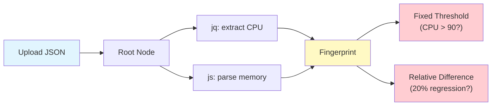
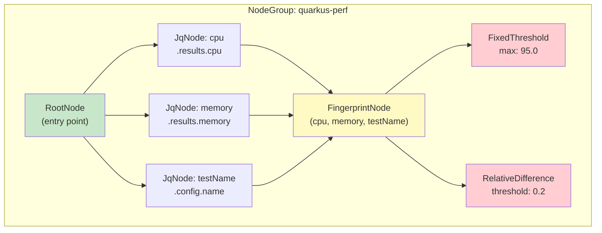
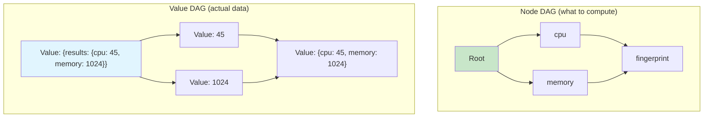
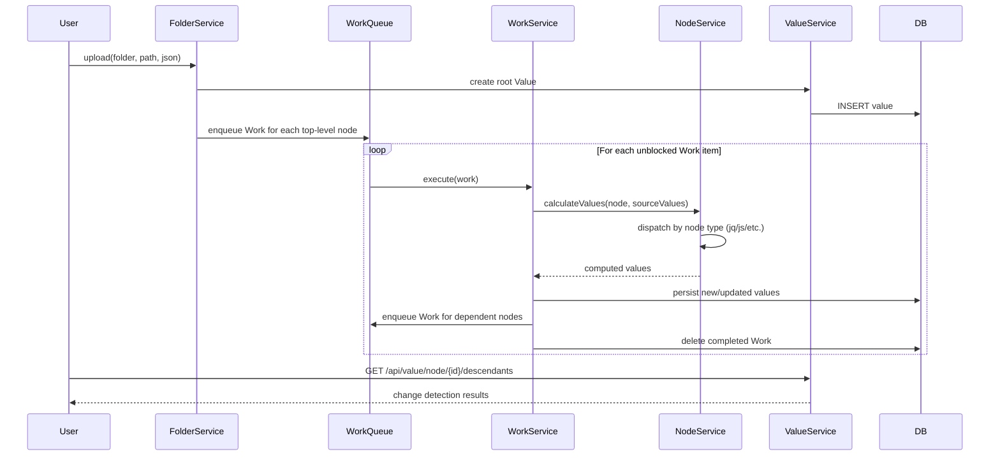
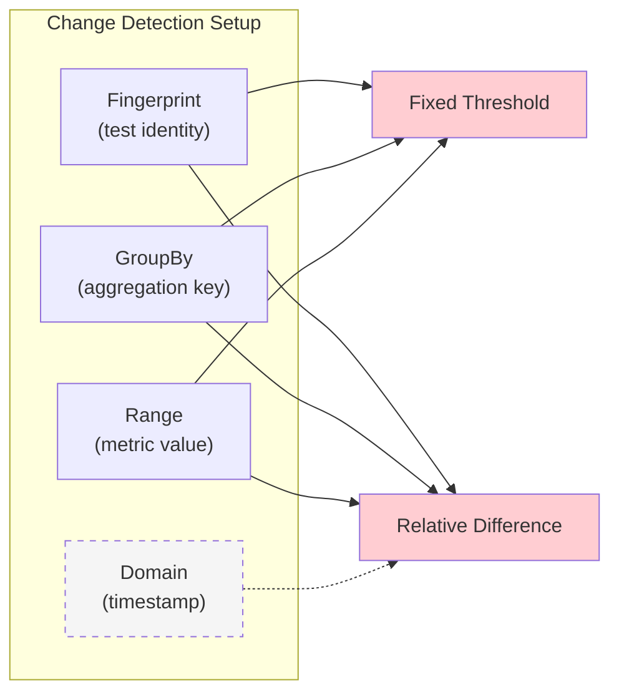
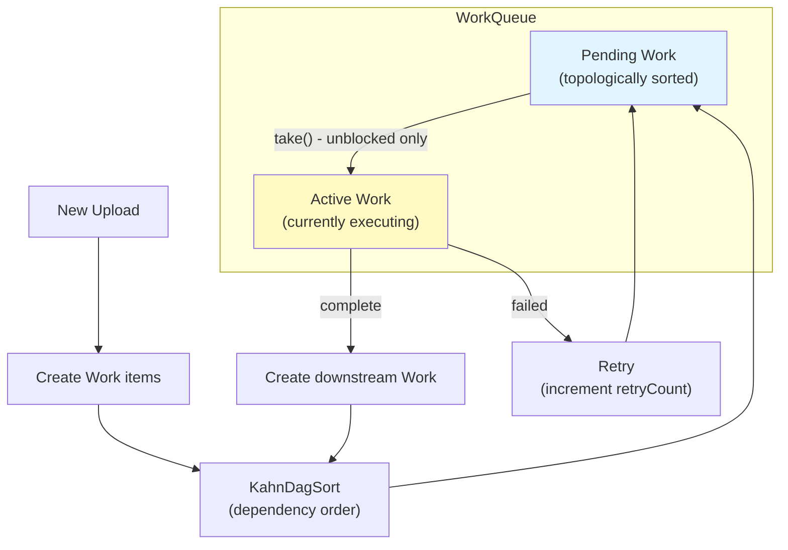
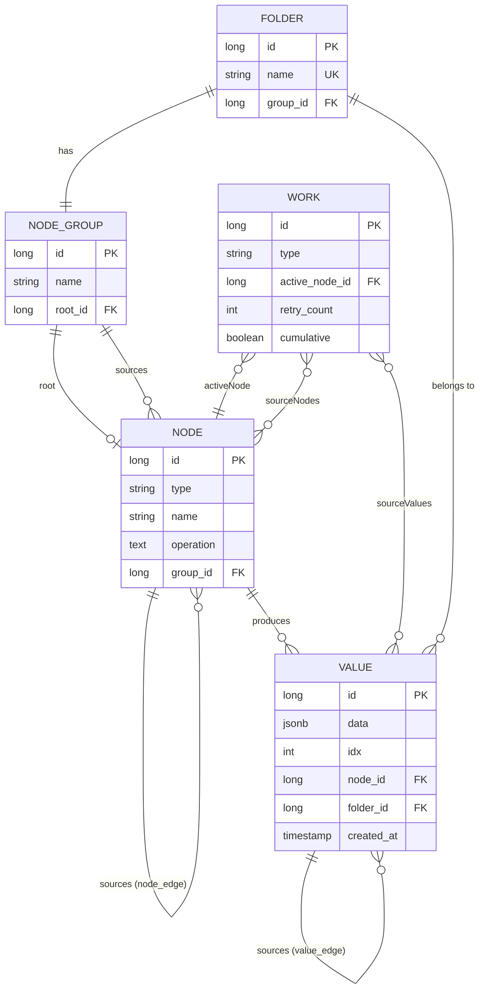
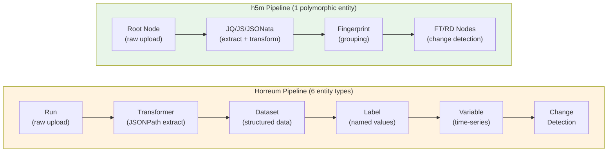

# h5m Architecture Guide

h5m is a lightweight rewrite of [Horreum](https://github.com/Hyperfoil/Horreum) -- a performance regression detection system. It replaces Horreum's complex multi-entity pipeline with a unified DAG of typed computation nodes.

## How h5m Works (The Big Picture)

h5m does three things:

1. **Accept JSON data** (performance results, benchmark outputs, etc.)
2. **Transform it** through a user-defined graph of operations (jq filters, JavaScript, JSONata, SQL)
3. **Detect changes** using statistical methods (fixed thresholds, relative difference)



Everything flows through **nodes**. Each node takes input from its parent nodes (sources), applies a transformation, and produces output values that feed into downstream nodes.

---

## Core Concepts

### Folder

A **Folder** is the top-level container. Think of it as a "test" in Horreum. Each folder has its own node graph and holds all computed values.

### Node Graph (DAG)

The node graph defines *what* to compute. Nodes are organized into **NodeGroups**, each with a **RootNode** as entry point. When data is uploaded to a folder, it enters through the root and flows through the graph.



### Node Types

| Type | Code | Purpose | Example |
|------|------|---------|---------|
| **Root** | `root` | Entry point, receives raw upload data | Auto-created per group |
| **JQ** | `jq` | jq filter expression | `.results.cpu` |
| **JavaScript** | `ecma` | GraalVM JS function | `(cpu, mem) => cpu / mem` |
| **JSONata** | `nata` | JSONata expression | `results.cpu` |
| **SQL JSONPath** | `sql` | PostgreSQL jsonpath (single result) | `$.results.cpu` |
| **SQL JSONPath All** | `sqlall` | PostgreSQL jsonpath (array result) | `$.results[*].cpu` |
| **Split** | `split` | Split JSON array into individual values | Breaks `[1,2,3]` into 3 values |
| **Fingerprint** | `fp` | Deterministic hash of source values | Groups change detection |
| **Fixed Threshold** | `ft` | Static min/max boundary check | Alert if CPU > 95 |
| **Relative Difference** | `rd` | Statistical trend detection | Alert on 20% regression |
| **User Input** | `user` | Manual data input (placeholder) | Future use |

### Values and the Value DAG

When a node computes a result, it creates a **Value** -- a JSON blob stored in the database. Values form their own DAG (the "value DAG") that mirrors the node DAG but tracks actual data lineage.



The node DAG is defined once; the value DAG grows with every upload.

---

## Data Flow: Upload to Change Detection

### Step-by-step



### Detailed flow

1. **Upload**: User sends JSON to a folder. A root `Value` is created.
2. **Work creation**: For each top-level node (nodes depending only on root), a `Work` item is created.
3. **Topological sort**: `KahnDagSort` orders work items so dependencies execute first.
4. **Execution**: The `WorkQueueExecutor` thread pool picks up unblocked work items.
5. **Calculation**: `NodeService.calculateValues()` dispatches to the appropriate node type handler.
6. **Change detection**: If new values differ from existing ones, downstream nodes are scheduled.
7. **Cascade**: The process repeats until no more downstream work exists.

### Multi-value handling

When a node has multiple sources, h5m combines them using one of two strategies:

```
Sources: cpu=[45, 50, 55], memory=[1024, 2048, 4096]

Length mode (zip):     NxN mode (cartesian product):
  (45, 1024)             (45, 1024)
  (50, 2048)             (45, 2048)
  (55, 4096)             (45, 4096)
                         (50, 1024)
                         (50, 2048)
                         ...
                         (55, 4096)
```

---

## Change Detection

### Fixed Threshold

Compares each value against static boundaries. Fires immediately on violation.

```
Configuration: min=10, max=90, minInclusive=true, maxInclusive=true
Input value: 95.3
Result: { "value": 95.3, "bound": 90, "direction": "above", "fingerprint": {...} }
```

Requires 3 source nodes:
- **Fingerprint** -- groups results (e.g., by test name)
- **GroupBy** -- aggregation key
- **Range** -- the numeric value to check

### Relative Difference

Detects trend shifts by comparing recent values against a historical baseline. Requires multiple uploads before it can fire.

```
Configuration: threshold=0.2, window=1, minPrevious=5, filter="mean"

Historical values: [100, 102, 98, 101, 99]  (baseline mean: 100)
New value: 78
Ratio: 78/100 = 0.78 → 22% decrease > 20% threshold
Result: { "value": 78, "ratio": -22.0, "previous": 99, "last": 78 }
```

Requires 3-4 source nodes:
- **Fingerprint** -- groups results
- **GroupBy** -- aggregation key
- **Range** -- the numeric time-series value
- **Domain** -- (optional) time/sequence axis



---

## Work Queue

h5m processes work in-process using a blocking priority queue with dependency tracking. No external message broker needed.



**Key properties:**
- Work items are topologically sorted by node dependencies
- A work item is "blocked" if it depends on another work item that is currently active or pending
- Cumulative nodes (RelativeDifference) depend on ALL prior work for the same node
- Unfinished work is persisted to the database and resumed on restart

---

## Entity Relationship Diagram



### Closure Tables

The DAG relationships are stored in two join tables:

| Table | Purpose | Columns |
|-------|---------|---------|
| `node_edge` | Node dependency graph | `child_id`, `parent_id`, `idx` |
| `value_edge` | Value data lineage | `child_id`, `parent_id`, `idx` |

These are standard JPA `@ManyToMany` join tables, not full transitive closure tables. They store direct edges only; transitive relationships are computed at query time via recursive SQL.

---

## h5m vs Horreum

### Pipeline Comparison



### Concept Mapping

| Horreum | h5m | Notes |
|---------|-----|-------|
| Test | Folder | Top-level container |
| Run | Upload (root Value) | Raw data entry |
| Transformer | JQ/JS/JSONata/SQL nodes | Data extraction -- h5m supports more languages |
| Dataset | (implicit) | No separate entity; values flow directly |
| Label | Node + Value | Combined: node defines the computation, value holds the result |
| Schema | (none) | Intentionally dropped -- added complexity without enough value |
| Variable | Node with time-series values | No separate variable entity |
| Change Detection | FixedThreshold / RelativeDifference nodes | Same algorithms, modeled as nodes in the DAG |
| Fingerprint | FingerprintNode | Same concept, first-class node type |
| Experiment | (not yet) | Planned |

### Architecture Differences

| Aspect | Horreum | h5m |
|--------|---------|-----|
| **Pipeline model** | 6 distinct entity types, linear flow | 1 polymorphic entity (NodeEntity), DAG flow |
| **Extraction** | JSONPath only | jq, JavaScript, JSONata, SQL jsonpath |
| **Message broker** | ActiveMQ Artemis (external) | In-process WorkQueue (no broker) |
| **Database** | PostgreSQL only | SQLite (default), PostgreSQL, DuckDB |
| **Authentication** | Keycloak OIDC | None |
| **UI** | React + PatternFly | CLI (REST API available) |
| **Schema validation** | JSON Schema (required) | None (intentional) |
| **DB migrations** | Liquibase versioned scripts | Hibernate auto-update |
| **Deployment** | Multi-service (app + DB + Keycloak + broker) | Single JAR or native binary |
| **Code size** | ~50k lines | ~5k lines |

### Why the Simplification?

Horreum's pipeline evolved organically, accumulating entity types for each processing stage. This made the data model hard to understand and extend:

- Adding a new extraction method required changes across Transformer, Dataset, and Label layers
- Schema validation added complexity but rarely caught real issues
- The external message broker added operational overhead for what is fundamentally an in-process computation

h5m collapses this into a single concept: **nodes in a DAG**. A JQ node, a fingerprint node, and a change detection node are all just nodes with different types. Adding a new computation type means adding one new NodeEntity subclass.

---

## Database Tables

```
folder                (id, name, group_id)
node_group            (id, name, root_id)
node                  (id, type, name, operation, group_id, ...)
node_edge             (child_id, parent_id, idx)
value                 (id, node_id, folder_id, data, idx, created_at, last_updated)
value_edge            (child_id, parent_id, idx)
work                  (id, type, active_node_id, retry_count, cumulative)
work_values           (work_id, value_id)
work_nodes            (work_id, node_id)
```

---

## CLI Quick Reference

```bash
# Folder management
h5m add folder my-perf-test
h5m list folders
h5m remove folder my-perf-test

# Add transformation nodes
h5m add jq to my-perf-test cpu '.results.cpu'
h5m add jq to my-perf-test memory '.results.memory'
h5m add js to my-perf-test ratio '(cpu, memory) => cpu / memory'

# Add change detection
h5m add fixed-threshold to my-perf-test cpu-alert \
    --fingerprint testName --range cpu --max 95

h5m add relative-difference to my-perf-test regression \
    --fingerprint testName --range cpu --threshold 0.2

# Upload data and view results
h5m upload results.json to my-perf-test
h5m list my-perf-test values
h5m list my-perf-test values by cpu as table
```

---

## Key Source Files

| Area | File | Lines | Purpose |
|------|------|-------|---------|
| **Entities** | `entity/NodeEntity.java` | 343 | Base node with DAG logic |
| | `entity/NodeGroupEntity.java` | 85 | Node container |
| | `entity/FolderEntity.java` | 33 | Top-level container |
| | `entity/ValueEntity.java` | 135 | Computed results |
| | `entity/work/Work.java` | 191 | Processing task |
| **Node types** | `entity/node/JqNode.java` | 93 | jq filter execution |
| | `entity/node/JsNode.java` | 174 | JavaScript execution |
| | `entity/node/FixedThreshold.java` | 163 | Threshold config |
| | `entity/node/RelativeDifference.java` | 140 | Trend detection config |
| **Services** | `svc/NodeService.java` | 1197 | Calculation engine |
| | `svc/FolderService.java` | 176 | Upload handling |
| | `svc/WorkService.java` | 151 | Work orchestration |
| | `svc/ValueService.java` | 581 | Value queries |
| **Queue** | `queue/WorkQueue.java` | 539 | Priority work queue |
| | `queue/KahnDagSort.java` | 108 | Topological sort |
| **CLI** | `cli/H5m.java` | 151 | Main entry point |
